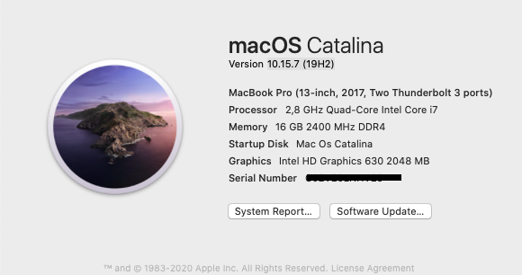

# Hackintosh HP Omen 15-ax243dx
Hackintosh on HP Omen 15-ax243dx using CLOVER r5127

    Core i7 7700HQ
    Intel HD 630
    GeForce® GTX 1050
    Intel® Series 100 chipset
    WiFi : Intel Dual Band AC-7265
    Ethernet : Realtek RTL8111H
    Audio : Realtek ALC295
    Touchpad : Synaptic 1509 PS/2
    15.6" HD display 1920x1080
    16GB, 8 GB + 8 GB 2400mhz DDR4
    128 GB SSD
    500 GB HD
    
# Functioning Components

    Intel HD 630 1536mb working
    Battery and power management
    Wifi
    USB C/3.0
    Ethernet port
    Audio
    Microphone
    Sleep/Wake functionality
    Mini Display Port

# Non-Functioning Components

    nVidia GTX 1050, I've disabled in bootargs
    SD card reader

# Notes

    Tested on Mac OS Catalina 10.15.7

